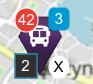

# Leaflet.markeroverlay

Custom Marker Overlay for Leaflet JS


## Example



```javascript
var busIcon = L.ExtraMarkers.icon({
        icon: 'fa-bus',
        markerColor: 'purple',
        shape: 'penta',
        prefix: 'fa',
    });
busIcon = L.MarkerOverlay.icon({
        icon: busIcon,
        badge: [{
            value: '2',
            style: 'holo',
            position: 'left bottom'
        },{
            value: '42',
            style: 'classic',
            position: 'left'
        },{
            value: function() { return 1+2; },
            style: 'nova',
        },{
            value: 'X',
            style: 'material',
            position: 'bottom'
        },
        ],
    });
var marker = L.marker([lat, lon], { icon: busIcon }).addTo(myMap);
```


